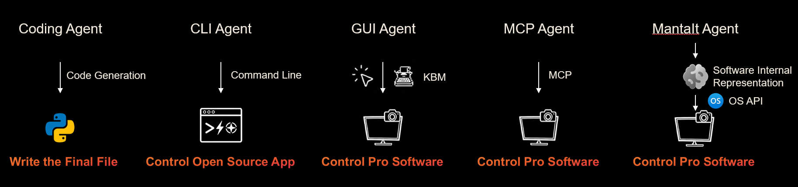

  <h1>
    
    MantaIt Agent
  </h1>
  
<strong>Your AI partner for operating real professional software.</strong>

  

    
    
  

> **Getting started & staying tuned with us.**
> Star us, and you will receive all release notifications from GitHub without any delay!

##  About

MantaIt Agent is an open-source creative agent for the professionals software use. It sees the screen, understands creative tasks, and operates real software across design, video, 3D, audio, CAD, and more. 

It currently supports on software like PowerPoint, Word, Excel, WPS, and AutoCAD, with support for software such as Premiere Pro, Photoshop, Blender, and DaVinci Resolve coming next. 

Prompting is only the beginning; the goal is to help AI work inside the actual creative workflow, from opening files and adjusting details to exporting results and iterating with you.

##  Feature

- **Real software, real work**: Operates the professional apps people already use, starting with PowerPoint, Word, Excel, WPS, and AutoCAD.
- **Desktop-native intelligence**: Understands your windows, documents, selections, files, and app context like a desktop creative partner.
- **Fast native control**: Uses structured interfaces like Windows COM, app APIs, scripts, and plugins instead of relying only on slow mouse-and-keyboard automation.
- **Collaborative and extensible**: Keeps humans in the loop while connecting to more agents, tools, APIs, and skills.

##  Architecture

  

Today's AI agents take very different approaches when it comes to actually using software:

- **Coding Agent**: generates code and writes the final file. Strong for engineering, but it does not operate the software a user opens.
- **CLI Agent**: drives open-source software through command lines. Fast and scriptable, but mostly limited to tools that expose a CLI.
- **GUI Agent**: controls professional software by simulating mouse and keyboard. Flexible, but slow, fragile, and easy to misclick.
- **MCP Agent**: talks to professional software through MCP servers. Clean protocol, but limited to whatever the server explicitly exposes.
- **MantaIt Agent**: operates professional software through its **internal representation** and the underlying **OS API**. Slides, cells, layers, drawings, and project files become first-class objects controlled through native interfaces such as Windows COM, app APIs, scripting engines, and plugins.

### Comparison

| Dimension | Coding Agent | CLI Agent | GUI Agent | MCP Agent | MantaIt Agent |
|---|---|---|---|---|---|
| Pro software ecosystem | ❌ Not supported | ⚠️ Open-source / CLI only | ✅ Any GUI app | ⚠️ Apps with MCP servers | ✅ Native pro apps |
| Accuracy | ✅ High | ✅ High | ❌ Low (pixel / click errors) | ✅ High | ✅ High |
| Speed | ✅ Fast | ✅ Fast | ❌ Slow (UI loops) | ✅ Fast | ✅ Fast (native calls) |
| Feature coverage | ❌ File output only | ⚠️ Limited to CLI commands | ⚠️ Wide but fragile | ⚠️ Limited to MCP surface | ✅ Wide and native to the app |
| Cross-software workflow | ✅ Strong (code / script glue) | ✅ Strong (shell pipelines) | ⚠️ Medium (window switching) | ⚠️ Medium | ✅ Strong (OS-level orchestration) |
| Works inside the user's GUI | ❌ Headless, no GUI | ❌ Headless, no GUI | ✅ Same app the user sees | ✅ Same app the user sees | ✅ Same app the user sees |
| Setup complexity | ✅ Low | ⚠️ Medium | ✅ Low | ❌ High (per-app server) | ✅ Low (install once) |

In short, MantaIt Agent is built to combine the **breadth of a GUI agent**, the **speed and accuracy of native automation**, and the **composability of a structured protocol**, without being limited to apps that already ship a CLI or MCP server.

This is what we mean by a *Computer Use Agent for professional software*: an agent that does not just see the screen, but truly understands and operates the software underneath.

##  Install Quick Start

##  Contributing

##  Roadmap

MantaIt Agent is moving fast. Here is what we are working on now, what is coming next, and what we want to build later.

### Now

- [x] Core agent runtime with planner, perception, and tool layers
- [x] Native control through Windows COM and OS APIs
- [x] First-wave software adapters: PowerPoint, Word, Excel, WPS, AutoCAD
- [x] Single-app task execution with human-in-the-loop confirmation
- [ ] Stable CLI and onboarding flow
- [ ] Local logs, task replay, and debug view

### Next

- [ ] Adapters for Premiere Pro, Photoshop, Figma, Blender, DaVinci Resolve
- [ ] Cross-software workflows (e.g. Excel → PowerPoint → export to PDF)
- [ ] Skill packs: reusable creative workflows shared across users
- [ ] Project memory: assets, decisions, and history per workspace
- [ ] Better safety layer: previews, confirmations, and reversible actions
- [ ] Plugin and extension API for third-party developers

### Later

- [ ] macOS support through native desktop APIs
- [ ] Linux support for open-source creative tools
- [ ] Multi-agent collaboration on the same project
- [ ] Marketplace for adapters, skills, and workflows
- [ ] Public benchmarks for professional software operation
- [ ] Self-hosted team edition with shared agents and workspaces

We track everything in [GitHub Issues](https://github.com/UseIt-AI/OpenCreativeWork/issues). If you want a feature or a new app supported, please open an issue or vote on existing ones.

##  Community

🎮 Discord: [Join the UseIt community](https://discord.gg/u3TTKAJYUm)

💬 WeChat:

We gratefully acknowledge MiraclePlus (YC China) for supporting this project.

