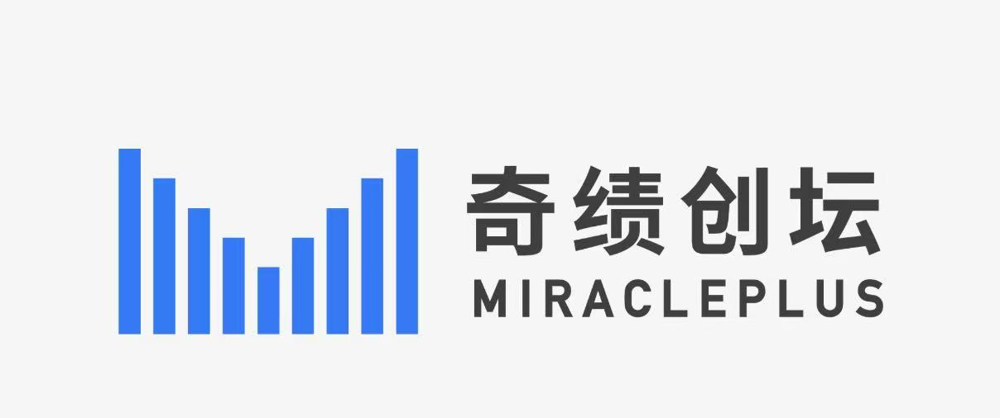

  <h1>
    
    MantaIt
  </h1>
  

    
    
  

##  About

##  Feature

##  Architecture

##  Install Quick Start

##  Contributing

##  Roadmap

##  Community

🎮 Discord: [Join the UseIt community](https://discord.gg/u3TTKAJYUm)

💬 WeChat:

We gratefully acknowledge MiraclePlus (YC China) for supporting this project.

